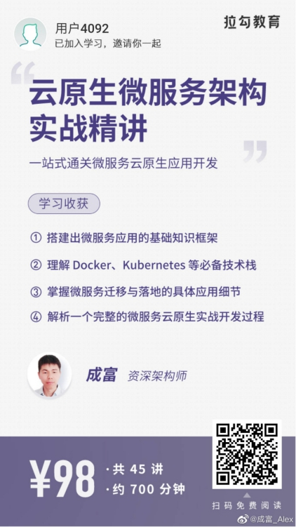

# 快乐出行

本应用是拉勾教育[《云原生微服务架构实战精讲》](https://kaiwu.lagou.com/course/courseInfo.htm?courseId=64)专栏的示例应用。本示例的内容会随着专栏不断更新。



# 本地开发

项目使用Maven构建，推荐使用IntelliJ IDEA开发。

本地开发需要Docker Compose的支持，在`dev`目录下有开发所需的Docker Compose文件。

# 本地部署

请参考`k8s`目录下的文档来部署到Kubernetes。

# 服务列表

下表是应用的服务及其说明。

| 服务名称  | Maven模块   |  API本地端口  |
|---|---|---|
| 乘客管理服务 |  `happyride-passenger-service`  |  `8500` |
| 行程管理服务 |  `happyride-trip-service`  |  `8501` |
| 地址管理服务  |  `happyride-address-service`  | `8502`  |
| 司机管理服务 |  `happyride-driver-service`  |  `8503` |
| 行程派发服务  |  `happyride-dispatch-service`  | 无  |
| 支付服务  |  `happyride-payment-service`  | `8504`  |
| 行程验证服务  |  `happyride-payment-service`  | `8505`  |
| 历史行程服务  |  `happyride-trip-history-service`  | `8506`  |
| 乘客管理界面的GraphQL服务  |  `happyride-passenger-web-api-graphql`  | `8610`  |


在Minikube中访问服务，首先显示乘客API服务的URL：

```sh
$ minikube service --url passenger-api-graphql -n happyride
```

再访问GraphQL提供的GraphiQL的界面 `<url>/graphiql`.